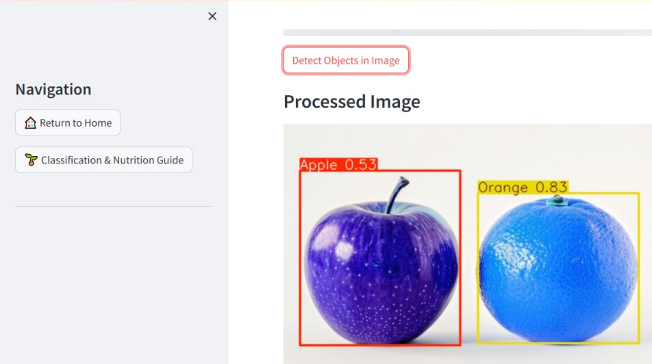

# Agricultural Products Analysis Platform 🌱

Welcome to the **Agricultural Products Analysis Platform**! This platform is designed to assist individuals and organizations in analyzing and classifying agricultural products, including fruits and vegetables, through modern machine learning and computer vision technologies. With two primary features, **Classification & Nutrition Guide** and **Object Detection (YOLO)**, users can seamlessly classify agricultural items and retrieve detailed nutritional information or perform object detection on images and videos.

## Introduction 👨‍🌾👩‍🌾

**Agricultural Products Analysis Platform** is a robust web application designed using **Streamlit**, focusing on two core functionalities: **classification** and **object detection** of agricultural products. 
With built-in support for **YOLO object detection** (You Only Look Once), this tool can detect and classify agricultural products from both images and videos in real-time.

---

## Features ✨

### Classification & Nutrition Guide 🥦🍓
This feature leverages powerful deep learning models like **VGG16**, **ResNet**, and **EfficientNet** to classify agricultural products. Once the product is classified, the platform provides the following benefits:
- **Accurate Classification**: The tool identifies the agricultural product, from fruits to vegetables, ensuring precise results. With an accuracy of **97%**, you can trust the classification results.
- **Detailed Nutritional Information**: After classification, users can view a comprehensive nutritional profile, which includes important nutrients like vitamins, minerals, fiber, and antioxidants.
- **Healthy Eating Recommendations**: Based on the classification, users can receive recommendations for healthy consumption and a balanced diet.

### Object Detection (YOLO) 🍏🍊
Powered by **YOLO (You Only Look Once)**, the **Object Detection** feature allows the platform to detect and locate fruits and vegetables in images or videos. This real-time detection feature offers:
- **Real-time Object Detection**: Upload images or videos, and the platform will detect and highlight agricultural products instantly.
- **Supports Images & Videos**: It works with both static images and dynamic video files, allowing for a versatile analysis of agricultural products.
- **Fast Processing**: Thanks to YOLO's advanced architecture, detection results are provided in real-time, ensuring a fast user experience.

---
## Image Gallery 🖼️
Here are some images showcasing the features of the platform:

--
## Technologies Used ⚙️

The Agricultural Products Analysis Platform is built using cutting-edge technologies to ensure performance, scalability, and ease of use. Here's an overview of the technologies used:

- **Streamlit**: A powerful Python framework for building interactive data applications. It’s fast, easy to use, and allows for quick development of machine learning applications.
- **YOLO (You Only Look Once)**: A state-of-the-art object detection algorithm that identifies objects in images and videos with high accuracy and speed.
- **OpenCV**: A computer vision library used for image and video processing, enabling the platform to handle video inputs seamlessly.
- **Pre-trained Deep Learning Models**: VGG16, ResNet, and EfficientNet models are used for image classification, all trained on large datasets to provide accurate predictions.

## 📌 Download Pretrained Models
The .pth model files are not included in this repository due to their large size.

You can download the pretrained models from the following link:
[Google Drive Link](https://drive.google.com/drive/folders/12PpxrmajiWoE1FQ6LCR1xPjyqI9jd_C8?usp=sharing)
Download Pretrained Models

After downloading the models:
Navigate to the **Classification-Nutrition-Guide/agricultural_classification/models** folder in your project.
Place the downloaded .pth model files into the models folder.

---
## Dataset Information 📊

This project uses the **Fruits Classification Dataset** to train and evaluate classification models. The dataset can be downloaded from Kaggle using the link below:

[Download Fruits Classification Dataset](https://www.kaggle.com/datasets/kritikseth/fruit-and-vegetable-image-recognition)

### Instructions:
1. Download the dataset from Kaggle.
2. Extract the dataset and place the images into the **`Classification-Nutrition-Guide/agricultural_classification/`** directory.

---
## How to Use 🎯
**Classification & Nutrition Guide Usage 📸**
From the sidebar, click on Classification & Nutrition Guide.
Upload an image of an agricultural product (e.g., a fruit or vegetable).
The platform will display the classification result, along with detailed nutritional information about the product.
The platform will also suggest healthy consumption tips based on the classification.

**Object Detection (YOLO) Usage 🎥**
From the sidebar, click on Object Detection (YOLO).
Upload an image or video file containing agricultural products.
The platform will process the file and provide real-time object detection results, highlighting detected fruits or vegetables.

---
## Accuracy 📊
The evaluation of the deep learning models used for classification and detection demonstrates high performance:

**EfficientNet:** Achieves 97% accuracy, providing highly reliable results for agricultural product classification.

**VGG16:** Reaches 96% accuracy, offering robust classification performance.

**ResNet50:** Maintains 95% accuracy, with solid performance across various agricultural product categories.

**YOLO (Object Detection):** Excels in real-time detection and segmentation, making it ideal for dynamic environments like videos and live interactions.

These models have been rigorously evaluated and validated on large datasets of agricultural products, ensuring that the platform can reliably classify and detect various fruits and vegetables with high accuracy.

---
## Directory Structure 🗂️

The project has the following directory structure:

agricultural-products-analysis/  
├── app.py                         # Main Streamlit application file  
├── requirements.txt               # List of required Python dependencies  
├── agricultural_classification/   # Folder for classification models  
│   └── app/                       # Classification app (Streamlit)  
├── Object-Detection-Yolo/         # Folder for YOLO object detection app  
│   └── yolo_app.py                # YOLO detection app (Streamlit)  
├── README.md                      # This README file  
└── models/                        # Folder containing pretrained models

